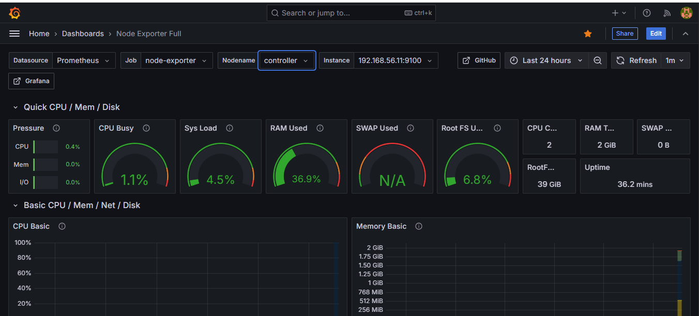
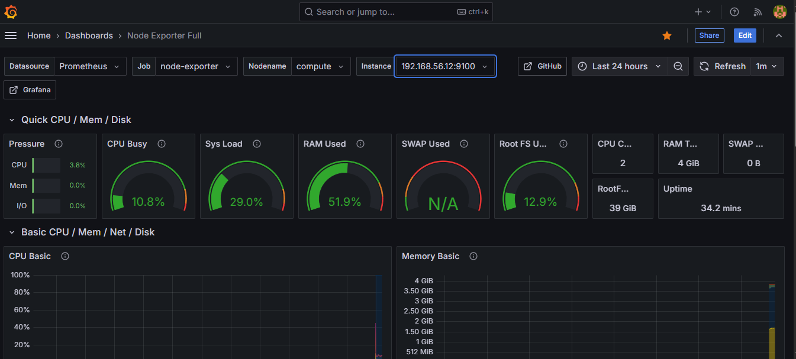
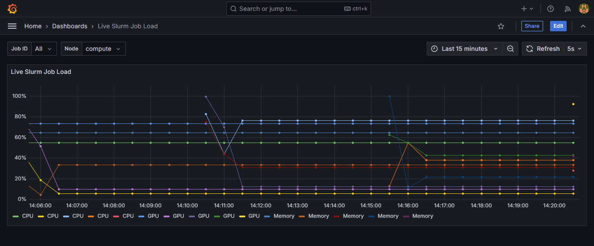

# HPC DevOps Hybrid Orchestrator

Grafana: https://grafana.local

## Prerequisites

- Git
- Vagrant
- VirtualBox

## Quick Start

From Windows PowerShell, run:

```powershell
git clone https://github.com/levintovich-devops/hpc-devops-hybrid-orchestrator.git
Set-Location .\hpc-devops-hybrid-orchestrator
vagrant up
```

Expected final VM state:

```text
Builder:    powered off
Controller: running
Compute:    running
```

Grafana may require several additional minutes after `vagrant up` finishes successfully while Grafana and the monitoring pods become ready. Refresh Chrome as needed.

## Grafana Access

Open Windows PowerShell as Administrator and configure the hosts file:

```powershell
$hostsFile = "$env:SystemRoot\System32\drivers\etc\hosts"
if (-not (Select-String -Path $hostsFile -Pattern '^\s*192\.168\.56\.12\s+grafana\.local\s*$' -Quiet)) {
    Add-Content -Path $hostsFile -Value "`r`n192.168.56.12 grafana.local"
}
ipconfig /flushdns
```

Open https://grafana.local in Chrome. A certificate warning may appear for the private lab certificate.

From Windows PowerShell, connect to Compute:

```powershell
vagrant ssh compute
```

Retrieve the Grafana admin username and password from the Kubernetes Secret:

```bash
sudo k3s kubectl get secret monitoring-grafana -n monitoring -o jsonpath='{.data.admin-user}' | base64 -d; echo
sudo k3s kubectl get secret monitoring-grafana -n monitoring -o jsonpath='{.data.admin-password}' | base64 -d; echo
```

## Expected Result

After deployment, Grafana displays Node Exporter metrics for both infrastructure nodes and simulated Slurm job metrics.





The following dashboard was captured after stopping and restarting the environment. The gap shows the shutdown period, while the new series confirm that scheduled Slurm reporting resumed successfully.



## Documentation

- [Architecture](docs/ARCHITECTURE.md)
- [Implementation](docs/IMPLEMENTATION.md)
- [Task](docs/TASK.md)
