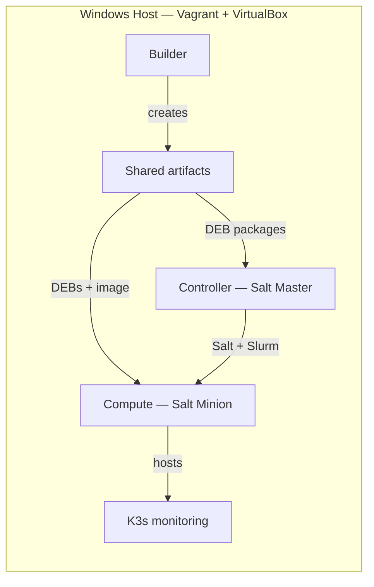
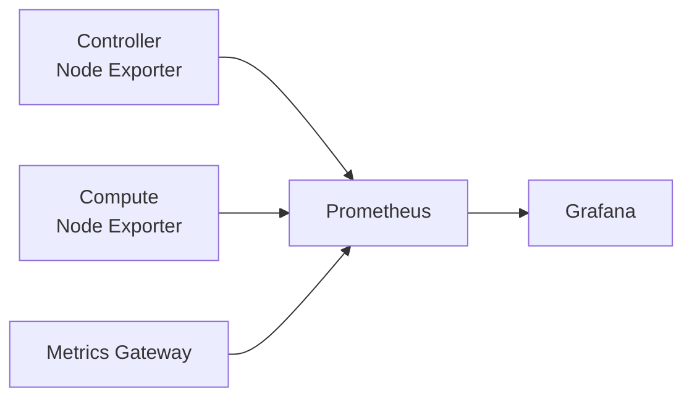
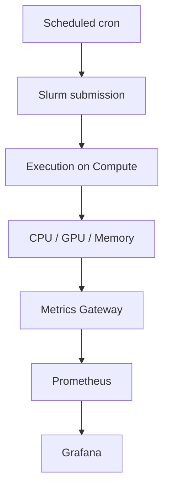

# HPC DevOps Hybrid Orchestrator Architecture

## 1. Infrastructure Topology

Vagrant and VirtualBox run the three-node environment. Builder creates shared artifacts, Controller manages Compute with Salt and Slurm, and Compute hosts K3s monitoring.

## 2. Observability Data Flow

Node Exporters and Metrics Gateway expose metrics. Prometheus scrapes and stores those metrics. Grafana queries Prometheus and visualizes the data.

## 3. Hybrid Loop

Cron submits a Slurm job to Compute. The job reports CPU, GPU, and memory values through the Metrics Gateway to Prometheus and Grafana.
